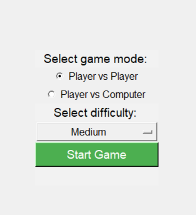
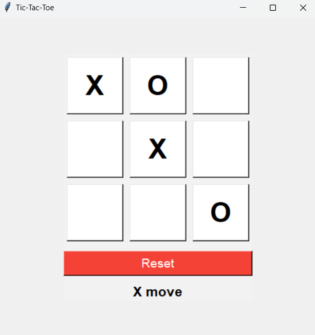

# Tic-Tac-Toe

A classic Tic-Tac-Toe game with a graphical user interface (GUI) implemented in Python using the Tkinter library.





## Table of Contents

- [Overview](#overview)
- [Features](#features)
- [Getting Started](#getting-started)
  - [Prerequisites](#prerequisites)
  - [Installation](#installation)
  - [Usage](#usage)
- [Contributing](#contributing)
- [License](#license)
- [Contact](#contact)

## Overview

This project is a simple implementation of the classic Tic-Tac-Toe game. It allows you to play against another player (Player vs. Player) or against the computer (Player vs. Computer). The computer player has adjustable difficulty levels (Easy, Medium, Hard).

## Features

- Player vs. Player (PvP) and Player vs. Computer (PvC) modes.
- Adjustable computer player difficulty levels.
- Reset the game at any time.
- Clear and intuitive user interface.

## Getting Started

### Prerequisites

- Python 3.x
- Tkinter (usually included with Python)

### Installation

1. Clone this repository:

   ```bash
   git clone https://github.com/yourusername/tic-tac-toe.git
   cd tic-tac-toe
   ```

### Usage
Run the game:
  ```bash
  python main.py
  ```

## Contributing
Contributions are welcome! To contribute to this project:

#### Fork the repository.
Create a new branch for your feature or bug fix: 
```bash
git checkout -b feature-name
git commit -m 'Add some feature'
git push origin feature-name
```

## License
This project is licensed under the MIT License - see the LICENSE file for details.

## contact
If you have questions or feedback, feel free to contact the author:

NIKHIL

[email](mailto:nikhiljangra264@gmail.com)

[Github](https://github.com/nikhiljangra264)